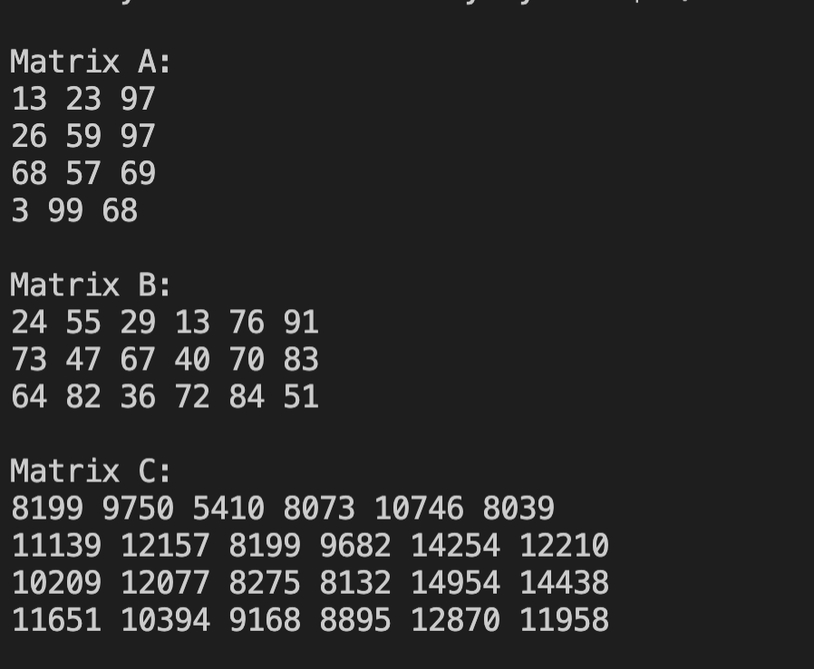

# Lab 5

### What it Does:
* This program uses threads in order to increase performance when calculating
the product of two matrices.

### How to Run:
* Type "make" into the terminal or command line
* Type "./matrix" to run the program

## Output
